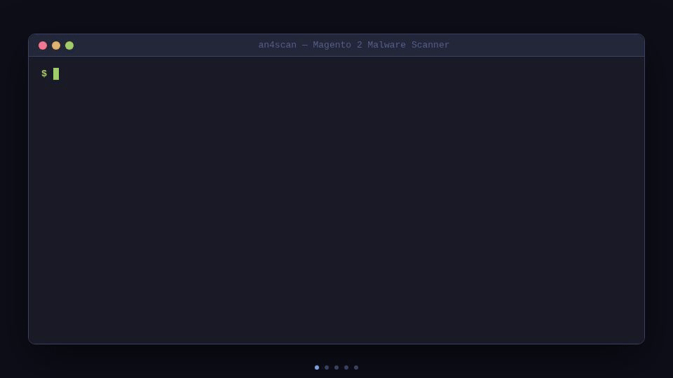

# AN4SCAN - Magento 2 Malware Scanner

Open-source security scanner for Magento 2. Detects backdoors, credit card skimmers (Magecart), obfuscated code, database injections, permission issues, known CVEs, and exploit attempts in access logs. Free, single-file, zero dependencies.

<p align="center">
  
</p>

## Features

| Module | Flag | What it does |
|--------|------|--------------|
| **File scan** | *(always on)* | 60+ regex signatures: CC skimmers, backdoors, webshells, obfuscation, Magento-specific patterns |
| **Version + CVEs** | `--version` | Auto-detect Magento version, check against 25+ known critical CVEs |
| **Database scan** | `--db` | Scan `core_config_data`, `cms_block`, `cms_page`, `email_template`, admin users, cron jobs |
| **Log analysis** | `--logs` | Parse Apache/Nginx access logs for exploit attempts, brute force, SQL injection |
| **Permissions** | `--permissions` | World-writable files, SUID/SGID scripts, readable `env.php` |
| **Modified files** | `--mtime` | Core files modified after install + integrity check on `app/code/Magento` overrides |
| **YARA scan** | `--yara` | 4 built-in binary rules + auto-load community rulesets (~1700 rules) |
| **Timeline** | *(automatic)* | Reconstructs infection timeline from file mtimes, logs, and findings |
| **All modules** | `--all` | Enable everything above |

## Install

```bash
curl -so /usr/local/bin/an4scan https://raw.githubusercontent.com/mabt/an4scan/main/an4scan.py
chmod +x /usr/local/bin/an4scan
```

Or clone:

```bash
git clone https://github.com/mabt/an4scan.git
cd an4scan && chmod +x an4scan.py
```

Requirements: **Python 3.8+** (no external dependencies). Optional: `mysql` CLI (for `--db`), `pip install yara-python` (for `--yara`).

## Usage

### Quick scan (confirmed threats only)

```bash
an4scan /var/www/magento2
```

By default, only confirmed threats (CRITICAL/HIGH) are shown: backdoors, skimmers, webshells, proven injections.

### Deep scan (include suspicions)

```bash
an4scan /var/www/magento2 --deep
```

`--deep` also reports suspicious patterns: obfuscation, unusual files, low-confidence matches (MEDIUM/LOW/INFO).

### Full audit (all modules)

```bash
an4scan /var/www/magento2 --all              # confirmed threats only
an4scan /var/www/magento2 --all --deep       # everything
```

### Common examples

```bash
# JSON report for CI/CD
an4scan /var/www/magento2 -j > report.json

# Version + CVE check
an4scan /var/www/magento2 --version

# DB + permissions + recently modified files (14 days)
an4scan /var/www/magento2 --db --permissions --mtime --mtime-days 14

# Access log analysis
an4scan /var/www/magento2 --logs
an4scan /var/www/magento2 --logs --log-path /var/log/nginx/access.log

# YARA scan with custom rules
an4scan /var/www/magento2 --yara --yara-rules /path/to/rules/

# Exclude paths (known false positives)
an4scan /var/www/magento2 --whitelist vendor/custom app/code/MyModule

# Save report to file
an4scan /var/www/magento2 --all -o report.txt

# One-line summary only
an4scan /var/www/magento2 --all -q

# Download community YARA rulesets
an4scan --update

# Show installed rulesets
an4scan --status
```

## Options

```
  path                    Magento 2 root path

scan modules:
  --db                    Scan database for injected malware
  --mtime                 Recently modified core files + integrity check
  --mtime-days N          Time window for --mtime (default: 7)
  --permissions           Check file permissions (world-writable, SUID/SGID)
  --version               Detect version and check known CVEs
  --logs                  Analyze access logs for exploit attempts
  --log-path PATH...      Access log file path(s) (auto-detected if omitted)
  --yara                  Enable YARA scanning (requires yara-python)
  --yara-rules PATH       Additional YARA rules file or directory
  --all                   Enable all modules
  --deep                  Include suspicions (default: confirmed threats only)

output:
  -j, --json              JSON output
  -o, --output FILE       Save report to file
  -q, --quiet             One-line summary only
  -s, --severity LEVEL    Override severity filter (CRITICAL/HIGH/MEDIUM/LOW/INFO)
  -v, --verbose           Show scan errors

tuning:
  -w, --workers N         Parallel workers (default: 4)
  --whitelist PATH...     Paths to exclude from scan

ruleset management:
  --update                Download/update community YARA rulesets
  --status                Show installed YARA rulesets
```

## Version & CVE Detection

The `--version` module:

1. Detects the version from `composer.lock`, `composer.json`, or the Magento framework
2. Identifies the edition (Community/Open Source or Enterprise/Commerce)
3. Checks EOL (End of Life) status
4. Matches against 25+ known CVEs with recommended patches

### Built-in CVE database

Covers critical vulnerabilities from 2022 to 2025:

| CVE | Severity | Description |
|-----|----------|-------------|
| CVE-2025-24434 | CRITICAL | Privilege escalation via REST API |
| CVE-2024-34102 | CRITICAL | **CosmicSting** — XXE/SSRF leading to RCE (actively exploited) |
| CVE-2024-39401 | CRITICAL | OS Command Injection — authenticated RCE |
| CVE-2024-20720 | CRITICAL | OS Command Injection via layout template (actively exploited) |
| CVE-2022-24086 | CRITICAL | **Template injection** — pre-auth RCE (mass exploited) |
| ... | ... | 20+ more HIGH/CRITICAL CVEs |

Example output:
```
  MAGENTO VERSION
  ────────────────────────────────────
    Version:  2.4.6-p3
    Edition:  Community (Open Source)
    Source:   composer.lock (product-community-edition)

  KNOWN VULNERABILITIES (CVEs)
  ────────────────────────────────────
  [CRITICAL] CVE-2024-34102
             CosmicSting - XXE/SSRF leading to RCE (ACTIVELY EXPLOITED)
             Affected: <= 2.4.6-p6 | Fix: APSB24-40 / Upgrade to 2.4.7-p1+
```

## Access Log Analysis

The `--logs` module parses Apache/Nginx access logs for exploit attempts.

### Auto-detection

Without `--log-path`, AN4SCAN searches:
- `/var/log/apache2/access.log`
- `/var/log/nginx/access.log`
- `/var/log/httpd/access_log`
- cPanel/Plesk log paths

### Detected patterns (LOG-001 to LOG-012)

- **CosmicSting** (CVE-2024-34102) — XXE exploitation attempts
- **Template injection** (CVE-2022-24086) — RCE via checkout
- **Admin brute force** — frequency-based detection (10+ attempts = alert)
- **PHP file uploads** in media/pub/static
- **Direct backdoor access** (shell.php, wso.php, etc.)
- **SQL injection** in URL parameters
- **Path traversal** (../../)
- **REST API enumeration**
- **Unauthorized API token creation**

### Suspicious IP report

Top attacking IPs are grouped with hit counts and matched patterns:

```
  TOP SUSPICIOUS IPs (from access logs)
  ────────────────────────────────────
    185.220.101.42     47 hits | Patterns: LOG-003, LOG-005, LOG-008
    91.242.217.81      23 hits | Patterns: LOG-001, LOG-006
```

## Infection Timeline

When `--mtime` or `--logs` is active, AN4SCAN builds an **infection timeline** by cross-referencing:

- Modification dates of detected malware files
- Creation dates of suspicious admin users
- Timestamps of exploit attempts in logs
- Last `composer update` date (reference point)

```
  INFECTION TIMELINE
  ────────────────────────────────────
  2024-08-15T03:22:11  · Last composer update (reference point)
  2024-09-03T14:33:02  → CosmicSting XXE exploit attempt (CVE-2024-34102)
  2024-09-03T14:35:18  → CosmicSting XXE exploit attempt (CVE-2024-34102)
  2024-09-03T14:41:55  ! Malware detected: eval() with base64_decode
                         pub/media/wysiwyg/.cache.php
  2024-09-03T14:42:03  ~ Core file modified after installation/update
                         vendor/magento/module-payment/Model/Method/Cc.php
  2024-09-04T02:15:00  ⊕ Suspicious admin user created recently
```

This helps identify:
- **Initial attack vector** — which CVE was exploited
- **Compromise window** — when the infection started
- **Lateral movement** — which files were modified and in what order

## Database Scan

The `--db` module reads credentials from `app/etc/env.php` and connects via the `mysql` CLI. No Python database library needed. Supports both TCP and unix socket connections.

**Tables scanned:**
- `core_config_data` — store config (URLs, injected scripts)
- `cms_block` — CMS blocks (HTML/JS content)
- `cms_page` — CMS pages (content + layout XML)
- `email_template` — email templates
- `admin_user` — recently created admin users
- `cron_schedule` — suspicious cron jobs

## Detection Categories

### Credit card skimmers (CC-001 to CC-007)
- Card number patterns in code
- Exfiltration via `fetch`, `XMLHttpRequest`, `WebSocket`, `sendBeacon`, `new Image`
- Known Magecart domains (typosquatting Google Analytics, jQuery CDN, etc.)
- Payment form interception
- Base64-encoded exfiltration URLs

### PHP backdoors (BD-001 to BD-012)
- `eval(base64_decode(...))` and variants
- Known webshells: WSO, C99, R57, B374K, FilesMan
- Direct execution of `$_GET`/`$_POST`/`$_REQUEST`
- `preg_replace` with `/e` modifier
- Arbitrary file upload
- Dynamic function construction (`chr()`, hex)

### Obfuscation (OB-001 to OB-007 + OB-ENT)
- Nested decoding chains (base64 > gzinflate > str_rot13...)
- Long base64 strings (>500 chars)
- Variable variables `${$var}()`
- Shannon entropy analysis (detects obfuscated code without known signatures)
- ionCube / Zend Guard (may hide malware)

### Magento-specific (MG-001 to MG-008)
- Modified core payment templates
- Malicious observers on checkout events
- Unauthorized admin user creation
- Modified `env.php` / `config.php`
- Unauthorized modules with suspicious code

### Server threats (SV-001 to SV-004)
- `.htaccess` redirects to malicious domains
- `.htaccess` enabling PHP execution in upload directories
- Persistent malware via cron jobs
- `mail()` exfiltration

### Suspicious filenames
- PHP files in `media/`, `static/`, `var/`, `cache/`
- Hidden files (`.x.php`)
- Double extensions (`.php.jpg`)
- WordPress files in a Magento installation
- Dangerous utilities (`adminer.php`, `phpinfo.php`)

### Database injections (DBI-001 to DBI-010)
- Injected JS scripts in CMS blocks and pages
- `<script>` tags loading external domains
- Base64 payloads in DB content
- Injected iframes
- PHP code in database fields
- Suspicious admin users (disposable emails, generic names)
- Suspicious cron jobs

### Permissions (PERM-001 to PERM-005)
- World-writable files and directories
- SUID/SGID bits on scripts
- PHP executable in web directories
- World-readable `env.php`

## YARA Support

### Do I need YARA?

**For a standard Magento audit: no.** The 60+ built-in regex signatures cover most threats. The base scan without YARA handles 90% of cases.

**YARA is useful when:**
- You're doing **deep forensics** and suspect advanced/custom malware
- You want access to **thousands of community rules** (webshells, hack tools, crypto miners)
- You need **binary detection** (hex patterns in obfuscated files, code hidden in images)

### Regex vs YARA

| | Built-in regex | YARA |
|---|---|---|
| Dependencies | None | `pip install yara-python` |
| Signatures | 60+ Magento-optimized | 4 built-in + thousands via community rulesets |
| Scan mode | Text, line by line | Binary, whole file |
| Strength | Fast, exact line numbers | Combined conditions (e.g. "JPG header + PHP code"), hex patterns |

### Setup

```bash
pip install yara-python
```

### Community rulesets (recommended)

AN4SCAN can auto-download 5 community rulesets (~1700 rule files):

```bash
an4scan --update    # download/update all rulesets
an4scan --status    # show installed rulesets
```

Rulesets are stored in `~/.an4scan/rules/` and loaded automatically with `--yara`.

| Ruleset | Content |
|---------|---------|
| [Sansec/ecomscan](https://github.com/gwillem/magento-malware-scanner) | Magento-specific signatures (skimmers, backdoors) |
| [Mage Security Council](https://github.com/magesec/magesecurityscanner) | Magento YARA rules (standard + deep scan) |
| [Neo23x0/signature-base](https://github.com/Neo23x0/signature-base) | Webshells, backdoors, hack tools (~700 rules) |
| [ReversingLabs](https://github.com/reversinglabs/reversinglabs-yara-rules) | Malware families (~300 rules) |
| [Elastic](https://github.com/elastic/protections-artifacts) | Cross-platform protections (~670 rules) |

### Usage

```bash
# Built-in rules only (4 binary rules)
an4scan /var/www/magento2 --yara

# With community rulesets (run --update first)
an4scan /var/www/magento2 --yara

# With additional custom rules
an4scan /var/www/magento2 --yara --yara-rules /path/to/custom-rules/
```

## Exit Codes

| Code | Meaning |
|------|---------|
| `0` | No CRITICAL or HIGH findings |
| `1` | At least one HIGH finding |
| `2` | At least one CRITICAL finding |

Useful for CI/CD:

```bash
an4scan /var/www/magento2 --all -j > report.json
if [ $? -eq 2 ]; then
  echo "CRITICAL: malware detected!"
  # send alert...
fi
```

## False Positives

Some legitimate patterns may trigger alerts (e.g. `eval()` in libraries, base64 in legitimate code). Strategies:

1. **Whitelist**: `--whitelist vendor/legitimate-module app/code/MyModule`
2. **Filter by severity**: default mode already filters to HIGH+ (use `--deep` to see everything)
3. **Auto-whitelisted paths**: `vendor/phpunit`, `dev/tests`, `setup/src`, `lib/internal/Magento/Framework/Code/Generator`

## License

MIT

## Contributing

Contributions welcome:

- New Magento malware signatures
- Additional YARA rules
- CVE database updates
- False positive reductions
- New log detection patterns
- Support for other e-commerce CMS (WooCommerce, PrestaShop)
